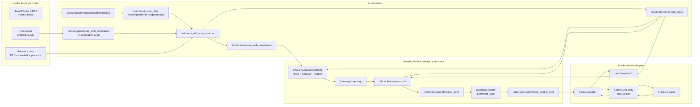
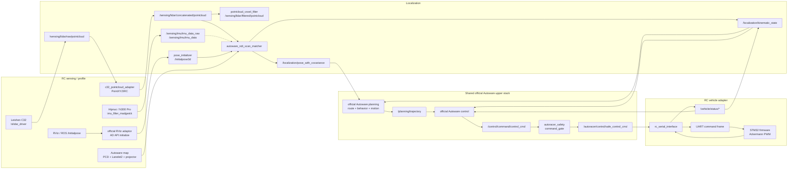

# Ackermann Autoware 系统架构

用途：定义 RC/Hooke 平台接入同一套 Autoware 系统时的运行时边界、profile 装配规则、node/topic/dataflow、控制链路和算法替换边界。非用途：不描述仓库目录结构，不写现场操作步骤，不保留历史迁移说明。

## 系统边界

本仓库维护 Ackermann 车辆平台的 Autoware integration boundary。平台差异通过 vehicle profile、sensor-kit profile、calibration、sensing launch、vehicle adapter 和 operation runbook 表达；共享 autonomy 行为通过 official Autoware topic/message/frame/diagnostics contract 连接。

Core boundary:

```text
sensing profile
  -> localization
  -> mission planning
  -> behavior and motion planning
  -> official control
  -> command_gate
  -> platform vehicle adapter
  -> chassis
```

Rules:

- RC and Hooke are first-class platform targets.
- Platform-specific facts stay in profile packages and adapter packages.
- Shared planning/control behavior stays behind official Autoware contracts.
- Chassis transport differences stay below the vehicle adapter boundary.
- `src/external/autoware` is a pinned upstream dependency area; 不在 `src/external/autoware` 里做隐形修改.
- 自研 planning/control 候选 must be explicitly wired through the same contracts.

## Profile 装配

Autoware launch discovers platform packages by `vehicle_model` and `sensor_model`.

```bash
ros2 launch autoware_launch autoware.launch.xml \
  vehicle_model:=autoracer_rc \
  sensor_model:=autoracer_rc_sensor_kit
```

| Launch argument | Package naming contract | RC package | Responsibility |
| --- | --- | --- | --- |
| `vehicle_model:=autoracer_rc` | `$(vehicle_model)_description` | `autoracer_rc_description` | Vehicle geometry, vehicle info, vehicle URDF/xacro. |
| `vehicle_model:=autoracer_rc` | `$(vehicle_model)_launch` | `autoracer_rc_launch` | Vehicle interface launch, safety gate wiring, RViz profile. |
| `sensor_model:=autoracer_rc_sensor_kit` | `$(sensor_model)_description` | `autoracer_rc_sensor_kit_description` | Sensor-kit URDF/xacro and sensor extrinsics. |
| `sensor_model:=autoracer_rc_sensor_kit` | `$(sensor_model)_launch` | `autoracer_rc_sensor_kit_launch` | LiDAR/IMU drivers, filtering, sensing topics. |

Hooke uses the same contract:

```text
vehicle_model:=autoracer_hooke
sensor_model:=autoracer_hooke_sensor_kit
```

Operator scripts are thin entrypoints:

- `scripts/rc/` starts and stops RC runtime flows.
- `scripts/hooke/` fails fast while Hooke profile packages are guarded.
- `scripts/common/` contains shared helpers and must not encode vehicle facts.

## 平台状态

| Platform | Vehicle model | Sensor model | Runtime status | Source boundary |
| --- | --- | --- | --- | --- |
| RC Ackermann | `autoracer_rc` | `autoracer_rc_sensor_kit` | active platform profile | `src/autoracer_rc_*` |
| Hooke | `autoracer_hooke` | `autoracer_hooke_sensor_kit` | `disabled_placeholder` / not runtime ready | `src/autoracer_hooke_*` |

Platform runtime status is commit-scoped. A commit may have one runnable
platform, multiple runnable platforms, or no runnable platform while a shared
contract is under modification. Runtime scripts must make that state explicit
and must fail fast for non-runnable profiles.

Hooke profile placeholders remain guarded by `COLCON_IGNORE` until the vehicle
description, sensor-kit description, sensing launch, vehicle launch, adapter
wiring, and calibration facts are present as coherent profile packages.

Reference material for Hooke integration:

```text
src/hooke2_vehicle
src/hardware_drivers
src/wd_msgs
```

Reference material is not a runtime profile by itself. Runtime launch selection
must use official profile packages.

## Nodeviewer/Dataflow

Direct-open nodeviewer-style graph:

```text
docs/architecture/rc_official_runtime_graph.html
```

The HTML graph is a static architecture view with embedded SVG. It opens in a
browser without Mermaid, CDN access, or a separate rendering step. It describes
node/topic/dataflow relationships; it is not an on-car HMI and not a repository
layout document.

## Shared Autoware Stack

The shared stack boundary is the same for every platform profile:

```text
/sensing/lidar/raw/pointcloud
/sensing/lidar/concatenated/pointcloud
/sensing/imu/imu_data
/localization/pose_with_covariance
/localization/kinematic_state
/planning/mission_planning/route
/planning/trajectory
/control/command/control_cmd
/autoracer/control/safe_control_cmd
/vehicle/status/*
```

Control path:

```text
/planning/trajectory
  -> official Autoware control
  -> /control/command/control_cmd
  -> autoracer_safety/command_gate
  -> /autoracer/control/safe_control_cmd
  -> platform vehicle adapter
```

Adapter responsibilities:

- Consume `/autoracer/control/safe_control_cmd` as the adapter-facing command.
- Publish `/vehicle/status/velocity_status`, `/vehicle/status/steering_status`, `/vehicle/status/gear_status`, and `/vehicle/status/control_mode`.
- Convert `/vehicle/status/velocity_status` to `/sensing/vehicle_velocity_converter/twist_with_covariance` for official localization stopped-check and gyro odometer consumers.
- Preserve Autoware units and frame semantics.
- Keep CAN/UART/byte protocol details inside the adapter.

## Hooke Platform Path



## RC Platform Path



The `Shared official Autoware upper stack` section is the common contract. RC
and Hooke differences are limited to sensing/profile facts, seed sources,
calibration assets, map assets, and vehicle adapter transport.

## Algorithm Boundary

Default upper-stack behavior uses official Autoware planning/control.

```text
src/autoracer_planning
src/autoracer_control
```

These packages are 自研 planning/control 候选. They are valid extension points
only when wired explicitly through the same official input/output contracts.

Rules:

- Preserve message types, units, frames, and diagnostics contracts.
- Replace modules in launch/profile configuration, not in shell wrappers.
- Keep `autoracer_safety` between upstream control and chassis adapters.
- Keep platform-specific forks below profile or adapter boundaries.

## Runtime Acceptance Order

1. Sensing/TF: pointcloud, IMU, static TF, and vehicle status topics are present.
2. Localization: map assets load, seed pose is accepted, NDT pose and `kinematic_state` publish.
3. Planning: route/goal generates `/planning/trajectory`.
4. Control: official control publishes `/control/command/control_cmd`.
5. Gate: disabled mode outputs stop; enabled mode publishes `/autoracer/control/safe_control_cmd`.
6. Adapter: command direction, velocity sign, steering sign, gear/control mode, and timeout behavior are correct.
7. Low-speed drive: run with explicit speed limits, collect bag/log evidence, and update reference facts if calibration changes.
